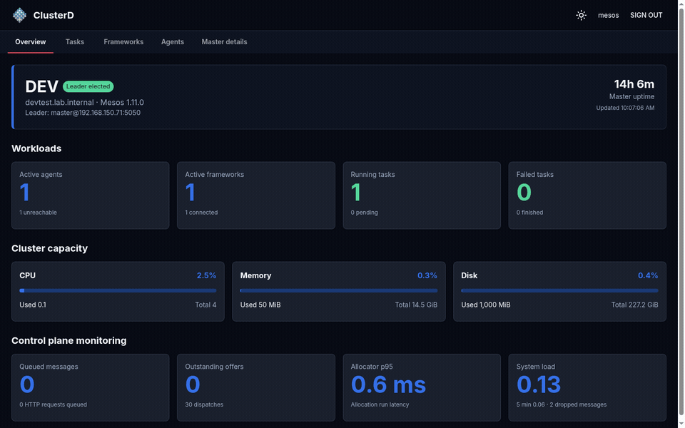

# ClusterD/Apache Mesos WebUI

<a href="https://matrix.to/#/#mesos:matrix.aventer.biz" target="_new"></a></span></a>
<a href="https://www.aventer.biz" target="_new"></a></span></a>

This project is a **React-based WebUI** for Apache Mesos/ClusterD. It is
modular, easy toextend, and uses react.

## Funding

[](https://www.paypal.com/donate/?hosted_button_id=H553XE4QJ9GJ8)


---

## Features

### Authentication and navigation

- Authenticated sign-in against the ClusterD master using Mesos/ClusterD credentials.
- Session-only authentication state with logout and automatic handling of expired credentials.
- Hash-based navigation for the overview, tasks, frameworks, agents, and master details.
- Responsive Material UI layout with light/dark theme switching.

### Cluster overview

- Live cluster dashboard with automatic refresh.
- Cluster name, hostname, Mesos version, leader status, and master uptime.
- Counts for active agents, active frameworks, running tasks, pending tasks, failed tasks, and finished tasks.
- Cluster capacity overview for CPUs, memory, disk, and GPUs.
- Control-plane monitoring for queued messages, outstanding offers, allocator latency, system load, dispatches, and dropped messages.
- Last-known data remains visible when a refresh fails, with a warning shown to the operator.

### Agents

- Table of registered agents with status and resource information.
- Agent detail dialog with:
  - identity, hostname, port, PID, Mesos version, and registration timestamps;
  - CPU, memory, disk, GPU, and port resources;
  - utilization percentages and progress indicators;
  - attributes and capabilities;
  - advanced resource data in a collapsed diagnostic section.
- Tasks currently associated with an agent are shown below the resource overview.
- Failed and finished tasks are hidden from the default agent task view.
- Agent log viewer with bounded log tails, refresh, auto-refresh, and UTF-8 decoding.

### Frameworks

- Separate tables for active, inactive, and completed frameworks.
- Framework rows open a detailed framework dialog while retaining the dedicated details action.
- Framework detail dialog with:
  - status, connection state, registration history, user, principal, and host;
  - framework ID, checkpointing, failover timeout, recovery, and Web UI link;
  - CPU, memory, disk, GPU, and port resources with used/offered values;
  - task, unreachable-task, completed-task, and executor counts;
  - roles and capabilities;
  - advanced framework data in a collapsed diagnostic section.
- Running-task preview limited to ten tasks with a dedicated scroll area.
- Framework ID is omitted from task tables where the framework context is already known.
- Separate **View all tasks** dialog with the complete task list and state-independent search by task name or task ID.

### Tasks

- Separate active, unreachable, and completed task tables.
- Global case-insensitive search by task name or task ID across all task states.
- Clickable task rows with keyboard support using Enter or Space.
- Task detail dialog with:
  - state, health, role, identifiers, framework, agent, host, and executor information;
  - resource allocations and limits for CPU, memory, disk, GPUs, and ports;
  - chronological status history;
  - advanced container data.
- Task log viewer for container stdout/stderr with bounded tails, refresh, auto-refresh, and stream selection.
- Interactive task shell through the Mesos agent nested-container session API when agent and container information is available.
- Task shell input is sent through the authenticated agent API and the session is aborted when the dialog closes.

### API and deployment support

- Same-origin production API requests suitable for serving from the ClusterD master.
- Development proxy for the master and explicitly allowlisted agent endpoints.
- Agent endpoint validation for hostname, port, and supported paths to avoid open proxy behavior.
- Production assets are prepared below `app/static/` for the Mesos WebUI deployment layout.
- Responsive tables and dialogs with deliberate empty, loading, and error states.

---

## Build and installation

1. Clone the repository and build the WebUI.

```bash
git clone <repo-url>
cd <project-folder>
make build
```

The deployable files are generated in `ui/build/`. The production build keeps
`index.html` at the WebUI root and places JavaScript and CSS below
`app/static/`, matching the routes exposed by the ClusterD/Mesos master.

2. Copy the **contents** of `ui/build/` to the configured WebUI directory on
every ClusterD/Apache Mesos master:

```bash
sudo install -d /usr/share/mesos/webui2
sudo cp -a ui/build/. /usr/share/mesos/webui2/
```

The resulting layout starts with:

```text
/usr/share/mesos/webui2/index.html
/usr/share/mesos/webui2/app/static/...
```

3. Configure the ClusterD/Apache Mesos master to use that directory, for
example:

```bash
vim /etc/mesos-master/webui_dir
/usr/share/mesos/webui2
```

After restarting the master, the UI is available through hash routes such as:

```text
https://master.example:5050/#/
https://master.example:5050/#/tasks
https://master.example:5050/#/frameworks
https://master.example:5050/#/agents
https://master.example:5050/#/master
```

The legacy `#/index.html` hash is accepted as an alias for the overview.

The part after `#` is a client-side UI route and is not sent to the HTTP
server. Assets therefore cannot be loaded "below `/#/`". Production builds
request them from `/app/static/`, the route exposed by the master for all
hashes. Development builds keep using the local React server. The
`view-source:` prefix is a browser command for displaying page
source and is not part of the deployment URL.

## Development

`make serve` starts the React development server and proxies ClusterD/Mesos API
requests to `https://devtest.lab.internal:5050`. This keeps browser requests
same-origin and avoids CORS errors; the development proxy accepts the master's
self-signed TLS certificate. Development remains available at
`http://localhost:3000/#/` and uses the same hash routes as production.

Use another master without changing the UI source:

```bash
make serve CLUSTERD_PROXY_TARGET=https://other-master.example:5050
```

The production build uses same-origin API URLs and is intended to be served by
the ClusterD master itself.

## WebUI slideshow

The slideshow was captured directly from the running WebUI. It demonstrates
the cluster overview, task and framework details, agents and their resources,
master information, and the light/dark color modes.




