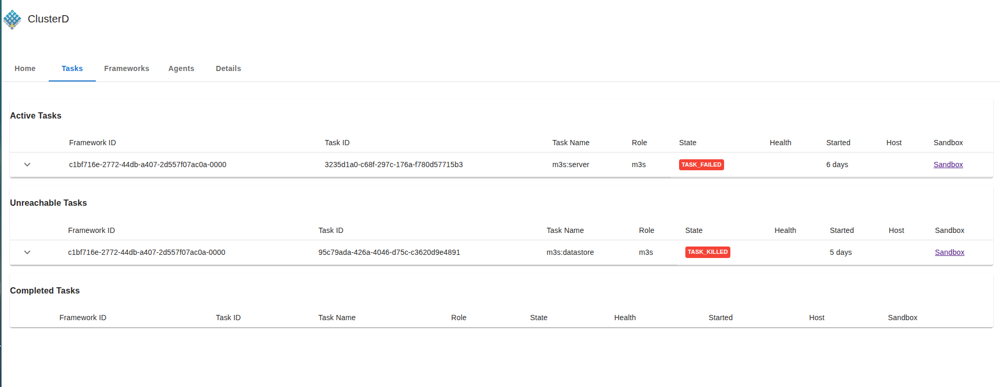
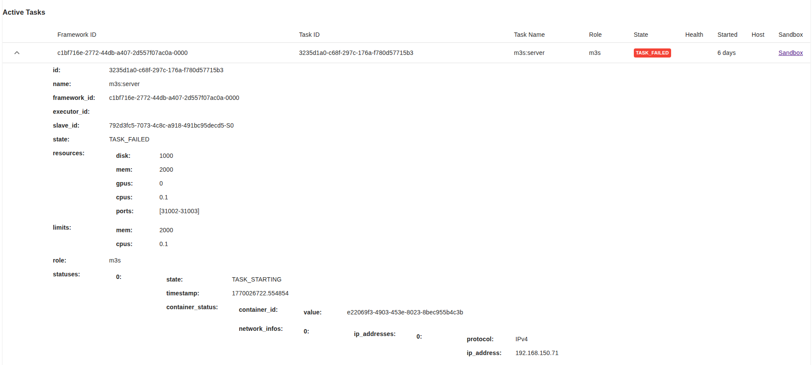

# Screenshots

These recordings document the UI as rendered in a real browser. Runtime values, IDs, hosts, and counters may differ on the next run.

## Overview

The animated slideshow covers the header, workload cards, cluster capacity, control-plane monitoring, tables, detail dialogs, and light/dark mode.

## Tasks and task details

This capture shows separate active, unreachable, and completed task tables, state badges, and the sandbox entry point.

The expanded row shows IDs, resources, limits, status history, and container data.

> These are documentation captures and may contain production-like names or IDs. Replace them with captures using synthetic data before publishing a public manual.
